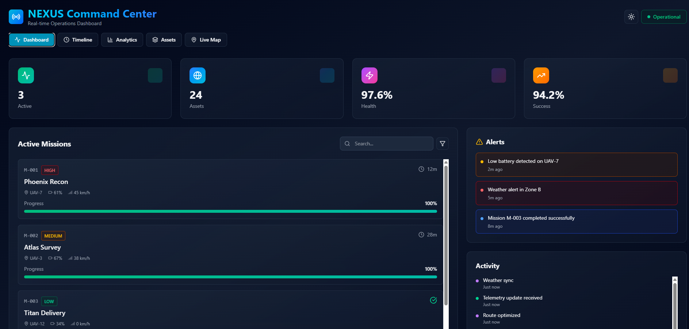

# 🚀 NEXUS Command Center

A high-fidelity, real-time operations command center dashboard built with React, TypeScript, and modern frontend architecture. This project demonstrates enterprise-grade UI/UX patterns, complex state management, and production-ready design systems.


## ✨ Features

### 🎯 Core Functionality
- **Real-time Mission Tracking** - Monitor active missions with live progress updates
- **Interactive Map View** - Visualize mission locations using Leaflet with custom markers
- **Mission Timeline** - Step-by-step mission lifecycle visualization (Standby → Active → Completed)
- **Analytics Dashboard** - Comprehensive charts and metrics (Area, Line, Pie charts)
- **Asset Management** - Track UAV fleet status, battery levels, and signal strength
- **Alert System** - Priority-based alerts with severity indicators
- **Activity Feed** - Real-time event log with automatic updates

### 🎨 Design Features
- **Dark/Light Mode** - Seamless theme switching with professional color schemes
- **Glassmorphism UI** - Modern backdrop blur effects and gradient accents
- **Responsive Design** - Fully optimized for mobile, tablet, and desktop
- **Micro-interactions** - Smooth animations and hover states throughout
- **Professional Typography** - Clean, readable font hierarchy

## 🛠️ Tech Stack

- **Framework**: React 18+ with TypeScript
- **Build Tool**: Vite 7.2+
- **Styling**: Tailwind CSS 4.1+ with PostCSS
- **Charts**: Recharts (Area, Line, Bar, Pie charts)
- **Maps**: Leaflet + React-Leaflet
- **Icons**: Lucide React
- **State Management**: React Hooks (useState, useEffect)
- **Animations**: CSS Transitions & Tailwind utilities

## 📸 Screenshots

### Dashboard View

*Real-time mission tracking with live stats and activity feed*

### Interactive Map

*Live map with mission markers and location tracking*

### Mission Timeline

*Step-by-step mission progress visualization*

### Analytics Dashboard

*Comprehensive charts and performance metrics*

### Light Mode

*Professional light theme with optimized contrast*

> **Note**: Replace placeholder images above with actual screenshots of your application. You can take screenshots and add them to a `screenshots/` folder in your repository.

## 🚀 Getting Started

### Prerequisites

- **Node.js** 18+ (recommended: 20+)
- **npm** 9+ or **yarn** 1.22+ or **pnpm** 8+

### Installation

1. **Clone the repository**
   ```bash
   git clone https://github.com/Godsmiracle001/mission-control-ui.git
   cd mission-control-ui
   ```

2. **Install dependencies**
   ```bash
   npm install
   # or
   yarn install
   # or
   pnpm install
   ```

3. **Start the development server**
   ```bash
   npm run dev
   # or
   yarn dev
   # or
   pnpm dev
   ```

4. **Open your browser**
   - Navigate to `http://localhost:5173` (or the URL shown in your terminal)
   - The app will automatically reload when you make changes

### Build for Production

```bash
npm run build
# or
yarn build
# or
pnpm build
```

The production build will be in the `dist/` directory.

### Preview Production Build

```bash
npm run preview
# or
yarn preview
# or
pnpm preview
```

## 📁 Project Structure

```
mission-control-ui/
├── public/                 # Static assets
│   └── vite.svg
├── src/
│   ├── App.tsx            # Main app component
│   ├── MissionControl.tsx # Core dashboard component
│   ├── main.tsx           # Application entry point
│   └── style.css          # Global styles & Tailwind imports
├── index.html             # HTML template
├── package.json           # Dependencies & scripts
├── tsconfig.json          # TypeScript configuration
├── postcss.config.mjs     # PostCSS configuration
└── README.md              # This file
```

## 🎮 Usage

### Navigation
- **Dashboard** - View active missions, alerts, and activity feed
- **Timeline** - See mission progress through lifecycle stages
- **Analytics** - Explore charts and performance metrics
- **Assets** - Monitor UAV fleet status and health
- **Live Map** - Interactive map with mission locations

### Features
- **Theme Toggle** - Click the sun/moon icon in the header to switch themes
- **Search & Filter** - Use the search bar and filter buttons to find specific missions
- **Real-time Updates** - Missions automatically progress every 3 seconds (simulated)
- **Interactive Map** - Click markers to see mission details in popups

## 🌐 Deployment

### Deploy to Vercel

1. **Install Vercel CLI** (optional)
   ```bash
   npm i -g vercel
   ```

2. **Deploy**
   ```bash
   vercel
   ```
   Or connect your GitHub repository directly on [Vercel](https://vercel.com)

### Deploy to Netlify

1. **Install Netlify CLI** (optional)
   ```bash
   npm i -g netlify-cli
   ```

2. **Deploy**
   ```bash
   netlify deploy --prod
   ```
   Or connect your GitHub repository on [Netlify](https://netlify.com)

### Deploy to GitHub Pages

1. **Install gh-pages**
   ```bash
   npm install --save-dev gh-pages
   ```

2. **Add to package.json**
   ```json
   {
     "scripts": {
       "predeploy": "npm run build",
       "deploy": "gh-pages -d dist"
     }
   }
   ```

3. **Deploy**
   ```bash
   npm run deploy
   ```

## 🔧 Configuration

### Environment Variables

Create a `.env` file in the root directory (optional):

```env
VITE_APP_TITLE=NEXUS Command Center
VITE_API_URL=http://localhost:3000/api
```

### Customization

- **Colors**: Modify Tailwind classes in `MissionControl.tsx` to change the color scheme
- **Data**: Update mock data arrays (`missions`, `assets`, `alerts`) in `MissionControl.tsx`
- **Update Interval**: Change the `setInterval` duration (currently 3000ms) for real-time updates

## 📝 Scripts

- `npm run dev` - Start development server
- `npm run build` - Build for production
- `npm run preview` - Preview production build
- `npm run lint` - Run linter (if configured)

## 🤝 Contributing

Contributions are welcome! Please feel free to submit a Pull Request.

1. Fork the repository
2. Create your feature branch (`git checkout -b feature/AmazingFeature`)
3. Commit your changes (`git commit -m 'Add some AmazingFeature'`)
4. Push to the branch (`git push origin feature/AmazingFeature`)
5. Open a Pull Request

## 📄 License

This project is licensed under the MIT License - see the [LICENSE](LICENSE) file for details.

## 👤 Author

**Godsmiracle001**
- GitHub: [@Godsmiracle001](https://github.com/Godsmiracle001)

## 🙏 Acknowledgments

- Built with [Vite](https://vitejs.dev/)
- UI components styled with [Tailwind CSS](https://tailwindcss.com/)
- Charts powered by [Recharts](https://recharts.org/)
- Maps provided by [Leaflet](https://leafletjs.com/)
- Icons from [Lucide](https://lucide.dev/)

## 🎯 Future Enhancements

- [ ] Backend API integration
- [ ] Real WebSocket connections for live updates
- [ ] User authentication & role management
- [ ] Export reports (PDF/CSV)
- [ ] Advanced filtering and search
- [ ] Mission creation workflow
- [ ] Notification system
- [ ] Mobile app version

---

⭐ If you find this project helpful, please consider giving it a star!
